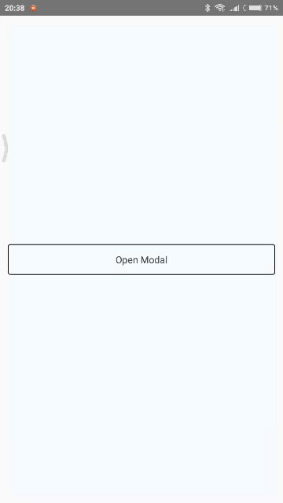

# React Native Modaly



## Installation
```
npm install react-native-modaly --save
```

## How to Use
```
import Modaly from 'react-native-modaly'
.
.
.
<Modaly
  isVisible={this.state.isVisible}
  >
  {YOUR CONTENT BE HERE}
</Modaly>
```

Thanks :D
